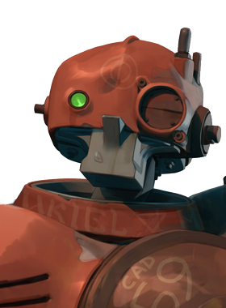

#   DeadBot 
DeadBot is an automation tool for maintaining the Deadlock Wiki - https://deadlocked.wiki/

## Setup
- pip install poetry
- python -m poetry install
- Download Decompiler.exe from https://github.com/ValveResourceFormat/ValveResourceFormat/releases
- Extract decompiler into `Downloads/` folder

## Usage
`bash main.sh`
